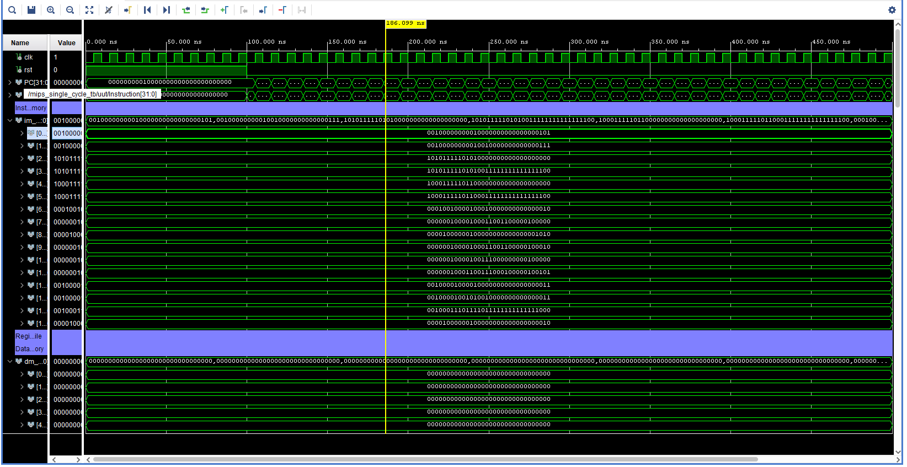
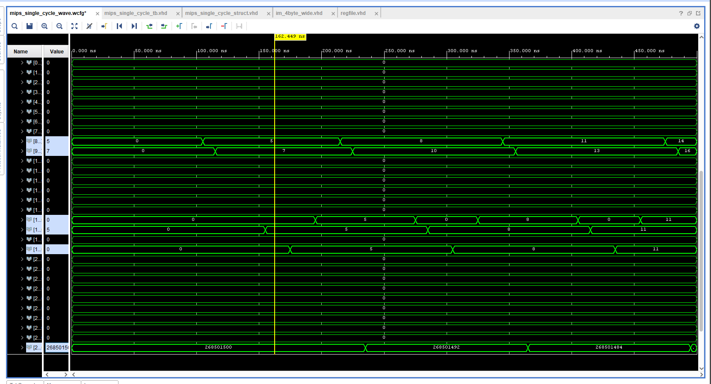
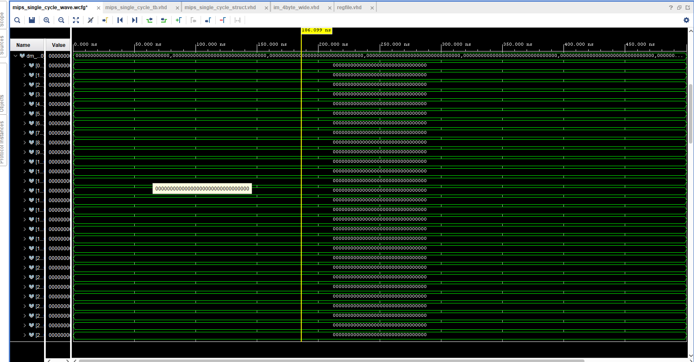
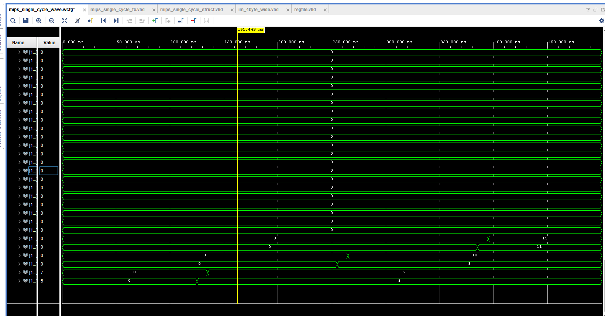
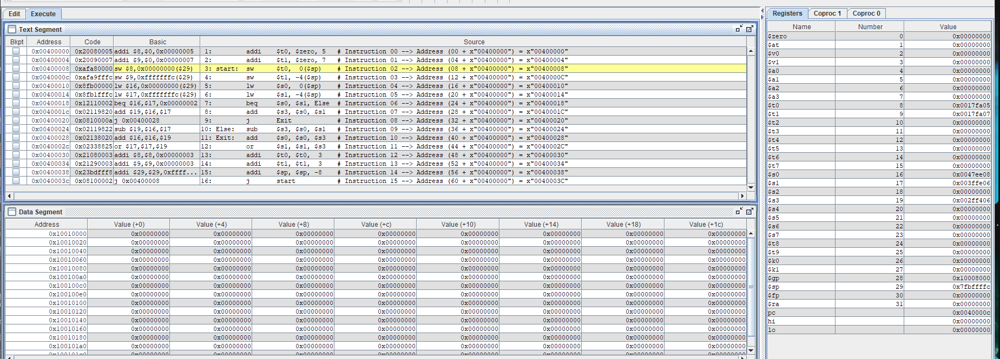

# MIPS Single-Cycle Processor — RTL Design & Verification

A fully functional, single-cycle MIPS microprocessor designed at the Register-Transfer Level (RTL) and verified using Xilinx Vivado. Developed as a final design capstone project at Florida Tech, this project implements hardware modules to execute fundamental MIPS instruction-set architecture (ISA) commands in a single clock cycle.

---

## 🏛️ System Architecture & Datapath

The processor features a decoupled datapath and control unit architecture, executing instructions by fetching from instruction memory, decoding via the control unit, reading from a custom register file, executing operations via the ALU, and interfacing with data memory.

### 🧩 Core Hardware Modules
* **Control Unit:** Decodes execution opcodes and function fields to dynamically assert routing mux control flags and ALU operations.
* **Arithmetic Logic Unit (ALU):** Handles core mathematical, logic, and branching evaluation constraints (e.g., `ADD`, `SUB`, `AND`, `OR`, `SLT`, `BEQ`).
* **Register File:** A synchronous 32 × 32-bit dual-read, single-write register block managing local runtime operands.
* **Program Counter (PC) & Memory Blocks:** Byte-addressable modules managing instruction sequencing and volatile data block persistence.

---

## 🚀 Key Engineering & Digital Design Solutions
* **RTL Synthesis Optimization:** Designed fully synthesizable, structural HDL code avoiding race conditions, latches, or unclocked feedback loops.
* **Modular Interface Design:** Implemented top-level component instantiations keeping functional blocks easily testable and decoupled.
* **Behavioral Verification:** Validated correctness through explicit testbenches simulating clock-cycles, tracking signal waveforms, and inspecting register state changes.

---

## 🛠️ Tech Stack & Tools
* **Hardware Description Language:** Verilog / VHDL
* **EDA Synthesis & Simulation Tool:** Xilinx Vivado Design Suite
* **Target Architecture:** MIPS32 ISA Subset

---

## 📂 Repository Layout
* **`/src`**: Core hardware description language source files containing the structural module layouts.
* **`/sim`**: Simulation files and behavioral testbenches used to verify circuit timing and signal validity.

---

## 📊 Verification & Simulation Results

To validate the behavioral accuracy of the RTL design, the processor's datapath was benchmarked using custom assembly test programs and cross-verified via hardware behavioral wave simulations in Xilinx Vivado alongside the MARS MIPS simulator environment.

### 1. Hardware RTL Simulation (Vivado)
The waveform profiles below illustrate execution correctness, sequencing through instruction fetches, programmatic multi-cycle branching, and accurate data synchronization across memory buses:

#### Core System Testbench & Instruction Bus


#### Register File Dynamic State Allocation


#### Memory State Configurations



---

### 2. Assembly Target Cross-Verification (MARS)
The core logic blocks were validated using an exact architectural reference map to track memory segment states, ensuring pipeline hardware behaviors precisely follow MIPS ISA constraints.



---

## ⚙️ How to View & Simulate in Vivado

### Prerequisites
* Xilinx Vivado Design Suite (2020.1 or newer recommended)

### Loading the Project
1. Clone the repository:
   ```bash
   git clone [https://github.com/liamprogulske/MIPS-Single-Cycle-Processor.git](https://github.com/liamprogulske/MIPS-Single-Cycle-Processor.git)
   ```
2. Open Vivado, select Open Project, and target your `.xpr` file

3. Click **Run Simulation** under the Vivado Flow Navigator to spin up the behavioral simulation waveforms and inspect data routing.
